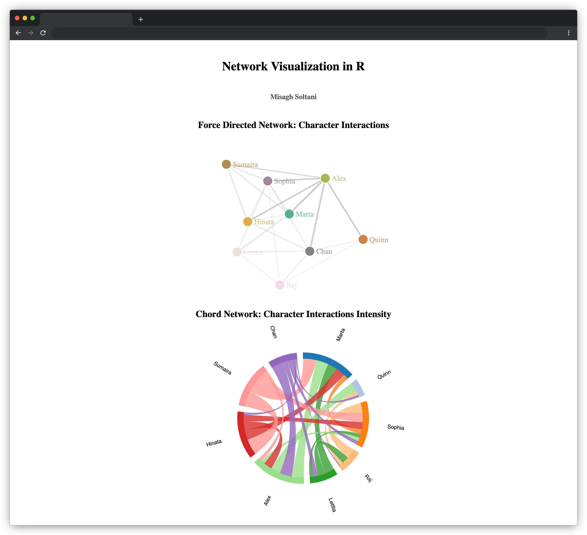

# Network Visualization in R

This repository is a course project that implements interactive network visualizations of character interactions. The data used is an Excel workbook containing two worksheets. It generates two network visualizations: a Force Directed Network and a Chord Diagram. These visualizations illustrate dialogue interactions between the primary characters.

## Table of Contents

- [Network Visualization in R](#network-visualization-in-r)
  - [Table of Contents](#table-of-contents)
  - [Project Overview](#project-overview)
  - [Files](#files)
  - [How to Run](#how-to-run)
  - [Visualizations](#visualizations)
    - [Screenshot](#screenshot)
  - [R Packages](#r-packages)

## Project Overview

This project aims to visually represent relationships between characters using two visualizations:

1. **Force Directed Network** – Displays character interactions in a network graph.
2. **Chord Network** – Illustrates interaction intensity between characters. Stronger relationships are shown with thicker chords.

## Files

- **`main.R`**: The R script is used to generate the visualizations.
- **`interactions_data.xlsx`**: The input data file containing two sheets:
  - **Primary Characters** – List of characters.
  - **Conversational Lines** – Number of lines spoken between pairs of characters.
- **`index.html`**: The generated HTML file containing the visualizations.

## How to Run

1. **R**: Have R installed.
2. **R Libraries**: Install the following libraries in R:

```R
install.packages(c("readxl", "dplyr", "networkD3", "htmltools", "RColorBrewer"))
```

3. **Generate Visualizations**: Open `main.R` in RStudio or an R environment and run the script. It will first process the data in `interactions_data.xlsx` and then generate the HTML file `index.html` that contains the Force Directed Network and Chord Network visualizations.
4. **View Output**: Open `index.html` in a web browser to interact with the visualizations.

## Visualizations

- **Force-Directed Network** displays character interactions as a network of nodes connected by links. Each node represents a character, while each link indicates the interaction frequency.

- **Chord Diagram** highlights interaction intensities. more frequent interactions have thicker chords between nodes.

### Screenshot



## R Packages

- `readxl`: For reading Excel data.
- `dplyr`: For data manipulation and transformation.
- `networkD3`: For generating D3 based network visualizations.
- `htmltools`: For formatting the HTML output for embedding in a web page.
- `RColorBrewer`: For generating color palettes.
